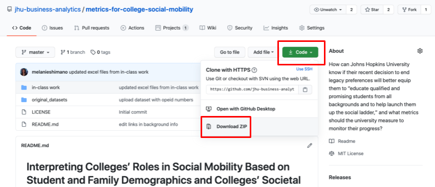
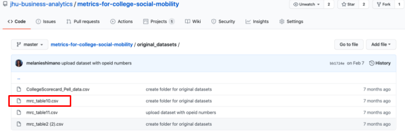
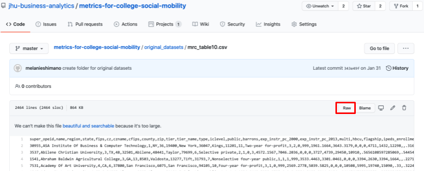
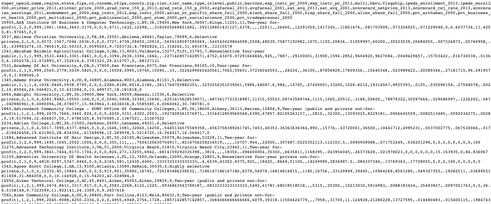
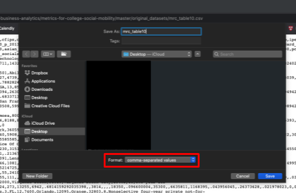
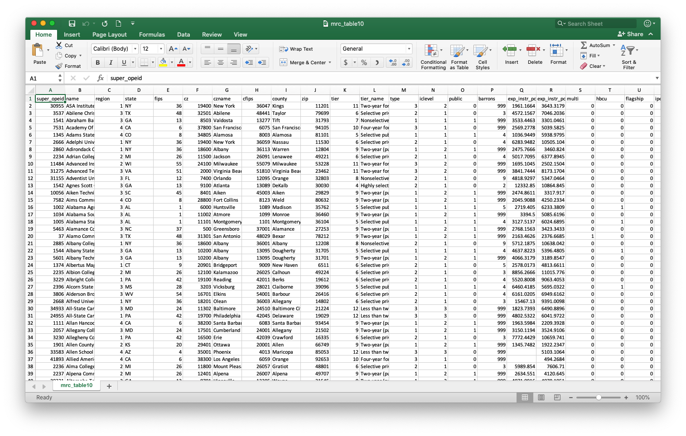

# Accessing the Data on GitHub

You can access all of the data we use in this tutorial via the links in the first page in this tutorial, on the Opportunity Insights[ Education data repository](https://opportunityinsights.org/data/?geographic_level=100&topic=0&paper_id=0#resource-listing), or on the [GitHub repository](https://github.com/jhu-business-analytics/metrics-for-college-social-mobility) for this example. We will work a lot with GitHub over the semester, so we'll review how to navigate and download data and files from GitHub repositories here.

## What is GitHub and How Will We Use It?

[GitHub](https://techcrunch.com/2012/07/14/what-exactly-is-github-anyway/?guccounter=1&guce_referrer=aHR0cHM6Ly93d3cuZ29vZ2xlLmNvbS8&guce_referrer_sig=AQAAAGdq3h2Ubcy_3VX32HrKyFPlhHbuuMfPJTE8p-_SVIYwy2W8wY0dBuatkLWTDMgJzoQHhcFS7R5ulBj_BVESEy42cCvycrMe7Gqxvq-uguR14Woa0HauR5eSmJVerZMMtcC24QoZR4UIRpngdcZFnA4i0M6nV6_QqvCOb0VdPuAD) is a repository hosting and version control web user interface most commonly used for managing open source software code and projects. We won't be writing any software in this course \(although we will dive into Python in the second half of the semester\), but we will use GitHub for managing our in-class data projects and your individual and group projects. 

Since we can make our projects publicly available, GitHub provides a great opportunity for you to save, share and continue to build on your data analytics portfolio. While you can list your work and experiences on a resume or on LinkedIn, providing a portfolio of your data analytics work will be helpful in future job, research, academic, or other pursuits so that your potential collaborators can get a good idea of what you can _actually_ do and how you can apply your skills to their current projects. You'll be required to keep all of your GitHub repositories publicly available \(except for the final project with Baltimore City if you are working with proprietary data\) so that you can share your work with others and so that your classmates can see your business analytics process, questions, and findings. 

## Navigating GitHub

To get started working on GitHub, you'll need to create an account on the landing page: 

Once you confirm your account, you'll be able to create, copy, and contribute to GitHub repositories and projects. We'll review how to do this in a later course, but for now, it's important that you get familiar with the platform and accessing data and notes in our class repositories. 

All of the repositories \(including original data and worked example files\) for this course will be available in the [JHU Business Analytics](https://github.com/jhu-business-analytics) repository and on Blackboard. Many of the examples that we cover this semester will be similar to examples covered in previous years, however, we will make an effort to update these to reflect current events, newly available data, and general student interests. If you have an idea for a potential data analysis in-class example, let us know on Slack!

## GitHub Repositories and README Files

The data and corresponding data files for this Excel foundations example is available in the [**metrics-for-college-social-mobility repository**](https://github.com/jhu-business-analytics/metrics-for-college-social-mobility) in our GitHub team. Each repository will contain a "README.md" document, which, as the name suggests, is the first thing that you should read before diving into the repository contents.

While there's not a specific standard for how anyone \*needs\* to format their README documents, they should generally tell you what the project is, what the repository contents mean, any requirements that someone might need to have to contribute to or carry out the project on their own, repository author information, and links to relevant sources \(e.g. data, etc.\). Our in-class example repositories will always contain:

1. Background information and outside sources for the business analytics problem we are investigating
2. Breakdown of the "Business Analytics Process" that we will go through to investigate this problem \(Business Question -&gt; Data Question\(s\) -&gt; Data Answer\(s\) -&gt; Business Answer\(s\)\), which includes the original data sources for our analysis and any other outside multi media that may be relevant to this challenge
3. Additional questions for you to explore and think through to better understand how we might apply our findings in a real-world setting

We'll outline what you need to add into your own project GitHub repositories in a later class.

### You can access the Excel files for our examples in two ways: 

#### **Downloading the entire repository file**

To download a copy of \(or "clone"\) the repository to your local computer files, click the green "Code" button, then "Download ZIP." The file should start to automatically download to your computer:

Once your download is complete, if you open up the "metrics-for-college-social-mobility-master" folder on your computer, you should find that it looks identical to the file structure in Github. We'll work with the mrc\_table10.csv first.

#### **Downloading individual, relevant CSV files**

If you don't want to download the entire file onto your computer, you can download individual CSV \(_comma separated values_\) or Excel files directly from GitHub. To do this, click on the [**original\_datasets**](https://github.com/jhu-business-analytics/metrics-for-college-social-mobility/tree/master/original_datasets) folder, and locate the mrc\_table10.csv document.

When you click this link, you'll see a page that gives you the CSV document. Since this file is quite large, our CSV preview is the raw text in our CSV file \(values separated by commas that will automatically reformat to cells if we open in Excel\). GitHub will automatically format smaller files to look similar to an Excel document with rows, columns, and cells. 

To download this file, click the "Raw" button:

To see the raw text of the CSV document:

If you look closely, you can get a sense for what this might look like when we use this in Excel. For example, the column names are the first string of text, and each row of data follows.

To save this as a CSV file onto your computer, click File&gt;Save As... and then make sure to save the file as a comma separated values file type. When you click Save, the file should automatically download to your computer.

When you open the document \(either from the cloned repository or the direct download\), this should open in Excel and look like a typical Excel document. If you're working on a Mac, then you might need to change your settings to make CSV documents automatically open in Excel instead of Pages, or you can use "CONTROL + click" &gt; Open With&gt; Microsoft Excel to open the document in Excel. Your document should look something like this:

 

