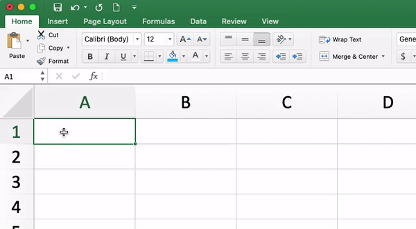
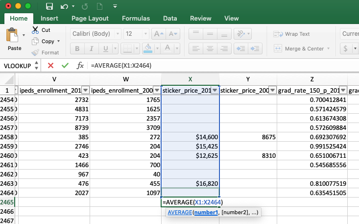
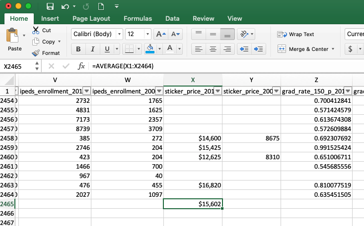

# Basic Excel Formulas

One of the more simple powerful tools in Excel is the ability to make calculations by writing **formulas** and automate these formulas based on the position inside an Excel document. We can write out explicit formulas with pre-programmed Excel functions or we can use the values in already existing Excel cells to create _dynamic_ calculations that can change based on the values in specific cells. 

### Writing Formulas

All Excel formulas start with an "=" followed by the equation that we want to calculate. For example, if we want to add 234 and 7739, we can type "=234+7739" into an excel cell, hit the enter/return key, and Excel will automatically reformat the cell to give us the answer \(7973\) in the cell instead of the text that we typed:



We can always view or edit the formula from our calculations if we view the formula bar at the top of our Excel sheet. 

While this is useful, we'll focus more on dynamic calculations based on the information in our dataset. This means that we can write formulas that use already existing data to help us derive meaningful insights.

For example, if we want to know the average sticker price of a US university in 2013, we can go to the bottom of our Excel sheet \(either scrolling to the bottom or using "COMMAND" + "down arrow" \(MacOS\) or "CONTROL" + "down arrow" \(Windows\)\), and typing:

```text
=AVERAGE(X1:X2464)
```

in cell X2465, then hitting the enter/return key.



You'll notice a few things that automatically happen when we start to type dynamic formulas: 

1. Excel will prompt us with suggested formulas based on text that we type and will give us a menu of available formulas that we might want to use in Excel \(to calculate the average we want to use the `AVERAGE` formula
2. Once we enter the type of formula that we want to use, Excel will let us know what kind of parameters we need to input into our formula for Excel to make the calculation in the light grey popup box underneath our cell or the formula bar. For example, to calculate the average, Excel is telling us to input the numbers we want to average separated by commas.
3. Instead of typing in the values that we want to calculate, we'll use the cell location to tell Excel what values we want to average. We can do this by clicking on each cell and separate each cell by a comma, however, this will be tedious and unnecessary. Instead, we can type "X1:X2462" to select all of the cells above our formula to average. Notice that Excel will highlight the cells involved in the formula calculation when you type their values. Alternatively, you can click and drag your mouse to select all of these cells.
4. After our formula is complete, we hit enter/return, and Excel will output the result of our formula \($15,602\), and we can revise or check on our formula by clicking on the cell and viewing the formula in the formula bar.



We'll review several formulas that might be useful for our analysis throughout the semester. In the meantime, some generally useful ones are: 

* SUM: add values
* AVERAGE: average values
* STDEV: standard deviation of values
* COUNT: count items
* MAX: maximum value in the row/column
* MIN: minimum value in the row/column

