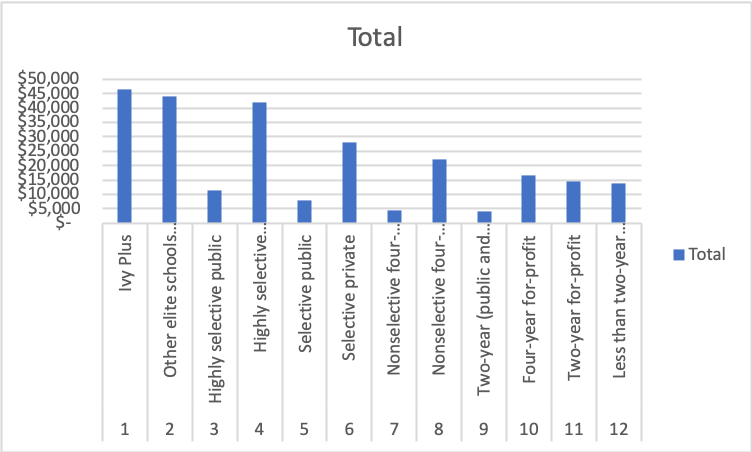
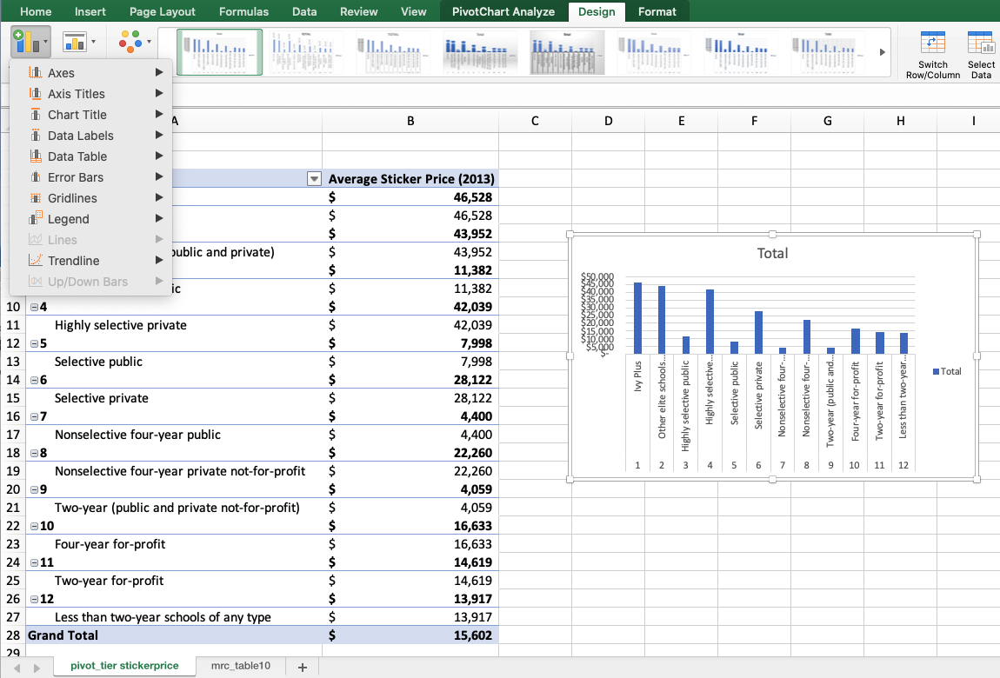
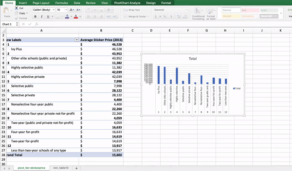
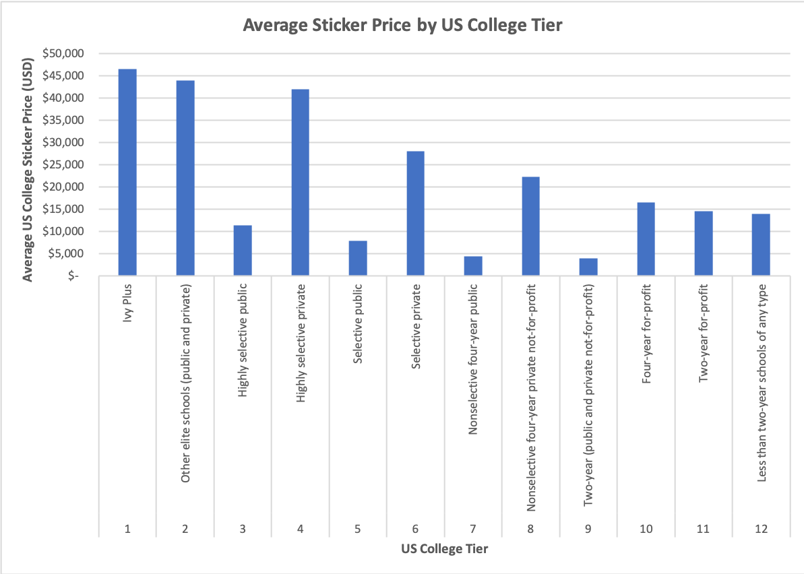

# Pivot \(and Excel\) Charts

We often want to make data visualizations to help us and our non-technical team members better understand what our data "says." Data visualizations \(charts, graphs, infographics, etc.\) help us better contextualize the numbers and relationships between similar values.

In this example, we'll create a data visualization based on our pivot chart, but these instructions are the same if we were to create a data visualization based on our original, unformatted data, except that we insert the chart with Insert&gt;Chart instead of with PivotTableAnalyze&gt;PivotChart.

### Inserting a Pivot Chart

To insert a pivot chart, you can either click on the PivotTable Analyze ribbon menu option or the Insert ribbon menu option, and click on the "PivotChart" button.

This will generate Excel's default graph in your current worksheet:

While this can be useful, this data visualization is not well-designed, so we'll want to edit the graph to make this more useful for our purposes:

### Editing Pivot Charts

To edit your pivot chart, click on the Design ribbon menu option, and edit the following elements through the Add Chart Element button:

* Add an x-axis label that says "US College Tier" \(I also bold this at the end\)
* Add a y-axis label that says "Average US College Sticker Price \(USD\)" \(I also bold this at the end\)
* Edit the graph title \(by double-clicking the current "Total" title\) to say "Average Sticker Price by US College Tier" \(I also bold this at the end\)
* Delete the legend by clicking on the existing legend and hitting "delete" on your keyboard. Legends can be very useful, but since we only have one data element, we don't need a legend here
* Resize the chart so that we can read the entire x-axis labels by dragging the chart corners and sides

Which gives us:

While this might not be the most well-designed chart, this is much better than the default settings. Additionally, we could share this data visualization with someone who is not familiar with the data, and they would be able to make some conclusions about the US college landscape in 2013 based on this graph. In later classes we'll dive deeper into how we can format and design data visualizations to have the most impact on our desired audience.

Check Blackboard for more videos on different kinds of pivot tables and pivot charts that might help us better understand our original business question: 

> _**How can Johns Hopkins University know if their recent decision to end legacy preferences will better equip them to “educate \[more\] qualified and promising students from all backgrounds and to help launch them up the social ladder,” and what metrics should the university measure to monitor their progress?**_

