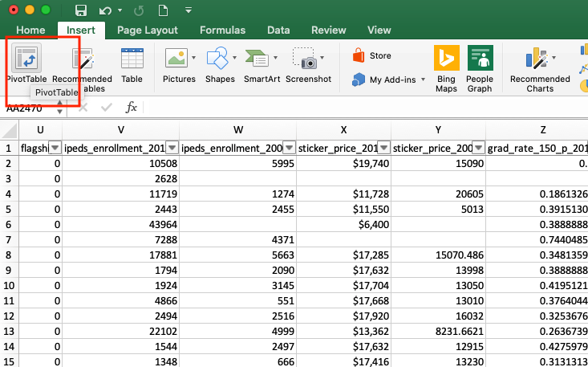
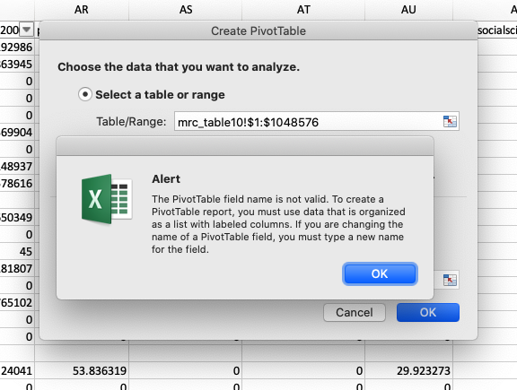
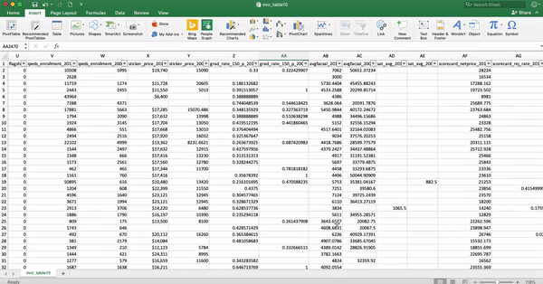
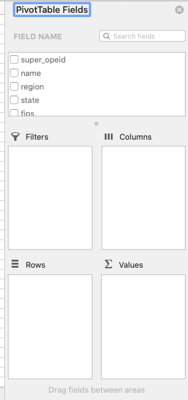
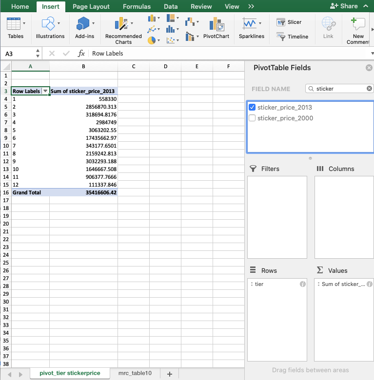
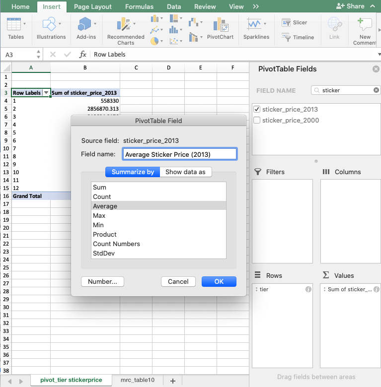
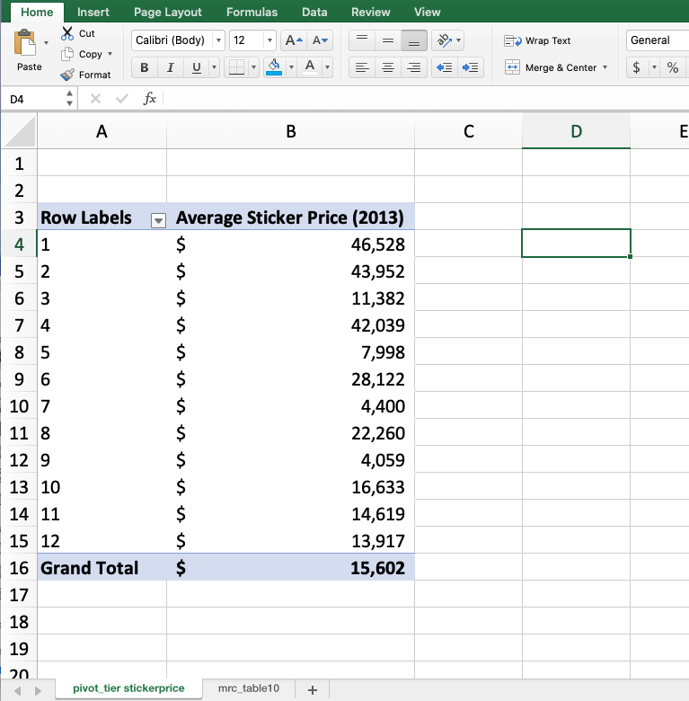
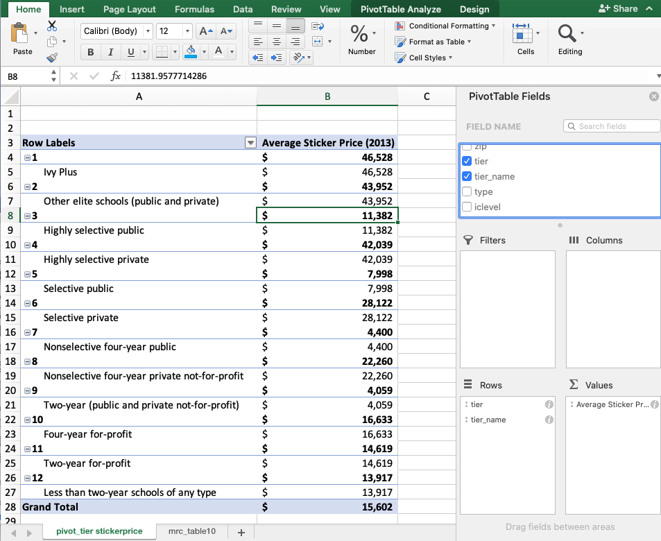

# Pivot Tables

While dynamic formulas and functions can be extremely useful to help us quickly calculate values, during our data exploration process we usually want to quickly see how our data is grouped and related so that we can make better decisions about how we should structure our analysis and future research. Pivot Tables can help us quickly group, manipulate, and sort information so that we can create meaningful data visualizations and insights.

### Creating Pivot Tables

If we go back to our original Business and Data Questions, one of the questions we wanted to answer was: 

> **What did the US college landscape look like in 2000 and 2013?** Exploring general college data regarding enrollment, sticker price, expenditures, and other related metrics per university "tier" or ranking

We can use filtering and functions to analyze the numbers more closely, but creating pivot tables can help us quickly answer a lot of these questions relatively quickly.

To create a pivot table, click on the Insert ribbon menu option, then on the PivotTable button:

We want to include all of our available data in our spreadsheet in our pivot table, so when Excel prompts us to select the data for our pivot table, we need to either \(1\) click on the top left \(or any\) corner, and then use hot keys to select the entire data set \("CONTROL" + "down arrow" then "CONTROL" + "right arrow" in MacOS or "COMMAND" + "down arrow" then "COMMAND" + "right arrow" in Windows\) or \(2\) click and drag your mouse to select all of the data in the Excel spreadsheet. If you try to select the entire spreadsheet by clicking on the light grey box in the top left corner, you will get the following error message since you haven't defined the rows and columns that you want to "pivot."

Next, select the "New worksheet" option to create your pivot table in a new worksheet instead of in the current worksheet \(since we have a ton of data here\), and click "OK."

We also want to rename our new spreadsheet to identify what we plan to use this spreadsheet for, for example "pivot-sticker price."

To manipulate and create our pivot tables, we'll drag and drop the variables \(column names\) in the field name sections to different areas in our pivot table constructor to build a new, aggregated table. 

To better understand how this works, we'll run through an example that might help us better understand the US college landscape in 2013.

### Pivot Table Example: Average College Sticker Price per College Tier

We already know the average US college sticker price in 2013 was $15,602, but how does the average sticker price change by university tier or ranking?

To figure this out, we'll create a pivot table where we drag the "tier" variable into the Rows square to set up our table that will aggregate values based on US college tier:

 Next, we'll drag the "sticker\_price\_2013" parameter into the "Values" square to indicate that we want to fill in our pivot table with information about the 2013 sticker price. You can find this parameter by scrolling through the list of field names, or you can type in "sticker" in the search fields box to find it faster. 

This automatically fills in values into our table based on how the numbers are grouped in college tiers, however, this isn't exactly the information that we want. Excel automatically assumes that we want to sum these values because they are numbers, but we want to take the average of these numbers! To change this, click on the small "i" circle button next to "Sum of sticker..." in the Values field.

Here we can edit the column name to "Average Sticker Price \(2013\)" and then select the "AVERAGE" calculation for our pivot table to perform instead of the sum. This gives us the values that we wanted:

However, these numbers aren't super user friendly, so we'll use the quick format edit buttons or Format&gt;Cells to edit these values to US currency with zero decimal places to end up with:

As we can see, the"Grand Total" or "average of the average" matches our calculation for the total average in our original dataset, but the average of each tier differs significantly. We might be able to guess what each of these tiers are by looking at their sticker prices, but to have a clearer understanding, we can also insert the "tier\_name" value underneath the "tier" value in the Rows box to contextualize the data.

This wouldn't be a table that we'd necessarily want to put on display in a report, but these labels can help us better understand what the data says.

Similarly, looking at only numbers can help us understand how the tiers are related, but we might want to create a data visualization to further help us understand how all of these tiers are related. 

